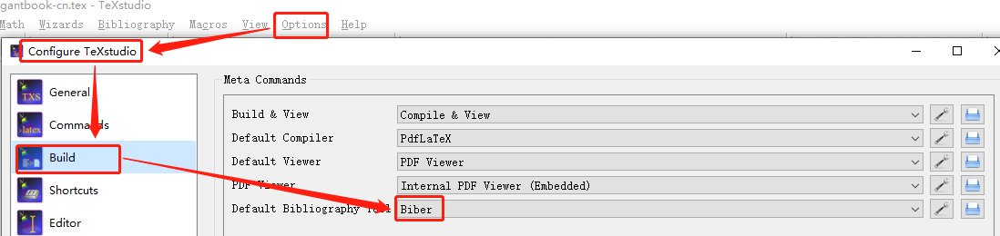

# 2023年春季学期——课程项目

翻译科技书籍：PFC.pdf，模板参考[ElegantBook](https://github.com/ElegantLaTeX/ElegantBook)。

## 贡献指南
1. 下载相关[开发工具](https://pan.baidu.com/s/1_ZLBRmA15gJzlRNJZYJElw) （提取码：dong），先安装`texlive`，再安装`texstudio`。
2. 使用`texstudio`打开`elegantbook-cn.tex`，点击菜单`Tools->Build & View`进行编译并查看生成的PDF文件。
3. 使用`texstudio`对应章节的`chap1/chap1.tex`，进行修改。
4. 重复步骤2和步骤3。 

### 本地检查`Pull requests`请求
有人发送`Pull requests`时，可以在 GitHub 上合并之前[测试并验证更改](https://docs.github.com/zh/pull-requests/collaborating-with-pull-requests/reviewing-changes-in-pull-requests/checking-out-pull-requests-locally) 。

### 开源项目管理

#### git管理

- [命令管理](https://blog.csdn.net/weixin_45682261/article/details/124003706)；
- 可视化工具管理：利用可视化工具[TortoiseGit](https://blog.csdn.net/xwnxwn/article/details/108694863)进行项目管理。

#### 代码提交

先进行本地提交（参考可视化工具管理），然后[推送到开源仓库](https://github.com/OpenHUTB/bazaar/issues/19#issuecomment-1471533397)。

### 开发建议

1. 图片统一放进image_pfc文件夹，并按照原文格式命名，如Fig_5_1；
2. 提交代码到开源仓库时创建分支，可按照章节或姓名命名。

### 参考文献
可以在谷歌学术、百度学术等中获得文献条目（bib item），然后把它们添加到`reference.bib`
中。在文中引用的时候，引用它们的键值（bib key）即可。
注意需要在编译的过程中添加`biber`编译，配置如下图所示。

## 持续集成/持续部署
[实现第一个Github Actions](https://docs.github.com/en/actions/quickstart) 。

参考[链接](https://mrturkmen.com/posts/build-release-latex/) ，通过 github actions 生成和处理 latex。

## 参与人

总编辑 ---- 王海东、段金焱 [Duan359](https://github.com/Duan359)

第一章  ---- 陈文宇 220720835018 [cwycwy299](https://github.com/cwycwy299) 

第二章  ---- 吴佳妮 220720835013 [jianiwuoo](https://github.com/jianiwuoo) 

第三章  ---- 周金爽 220720835019 [superzeroT](https://github.com/superzeroT)

第四章  ---- 陈艺琳 220720835024 [chenyl111](https://github.com/chenyl111)

第五章  ---- 刘家琪 220720835025 [AwooDancer](https://github.com/AwooDancer)

第六章  ---- 文沛然 220720835036 [wpr123](https://github.com/wpr123)

第七章  ---- 张洋铨 220720835014 [Purpleashes](https://github.com/Purpleashes)

第八章  ---- 谢恩坪 220720835037 [half-white](https://github.com/half-white)

第九章  ---- 吴玉庭 220720835001 [Sandra2Ha](https://github.com/Sandra2Ha)

第十章  ---- 雷利民 220720835005 [Shadow0714](https://github.com/Shadow0714)
