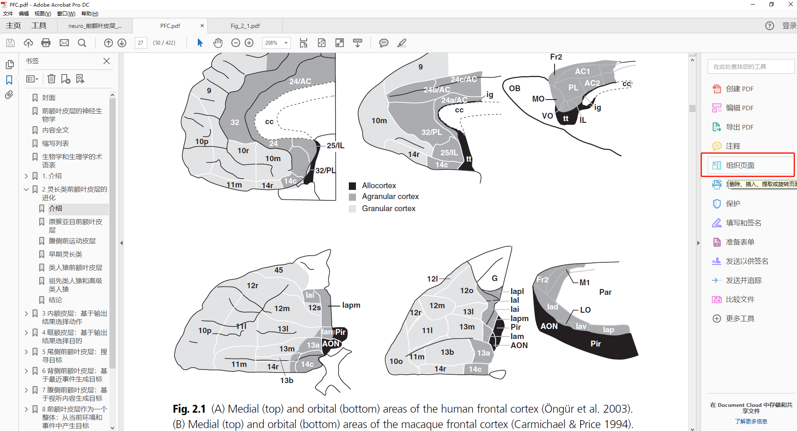
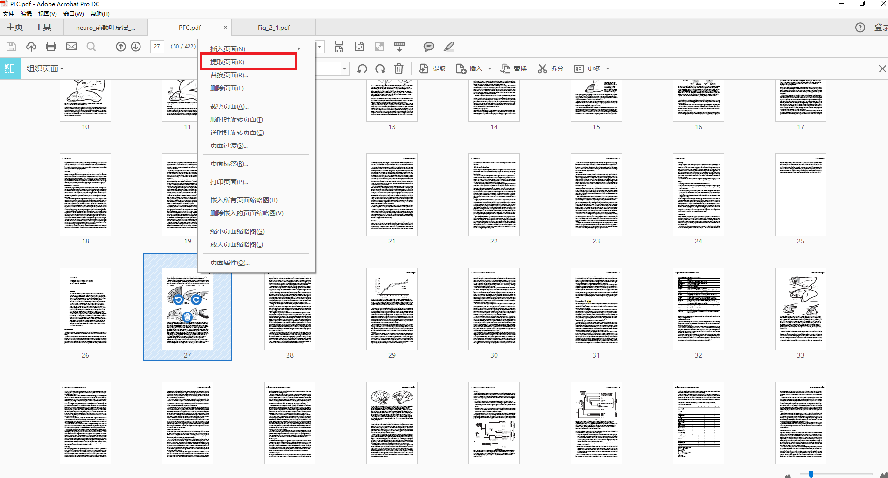
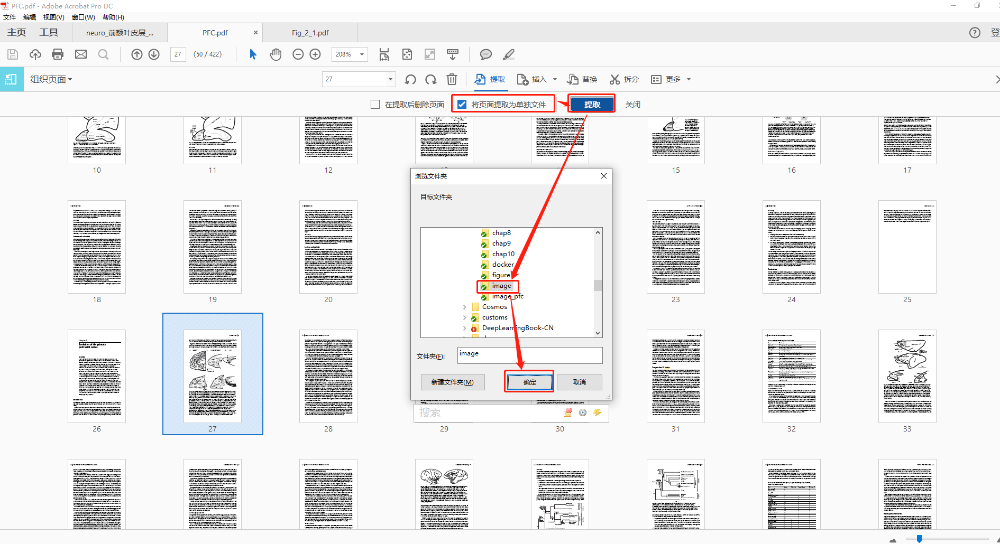
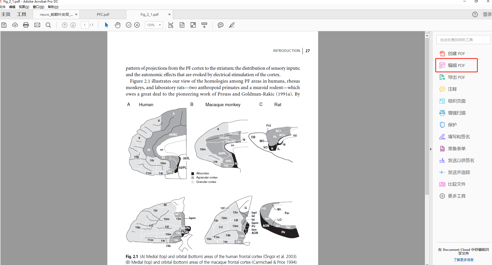
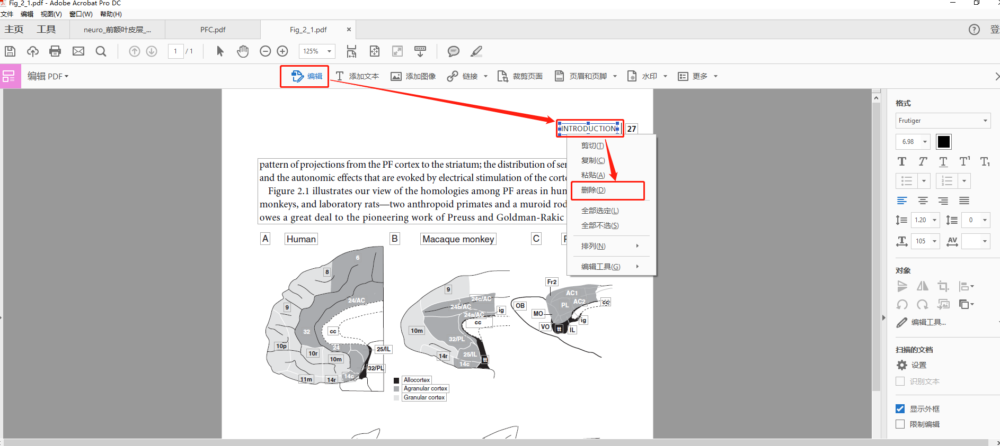
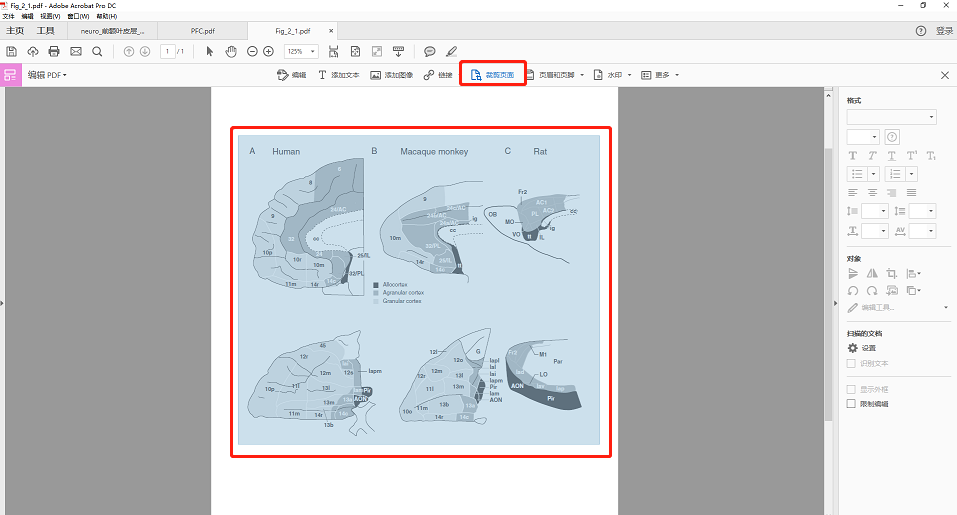
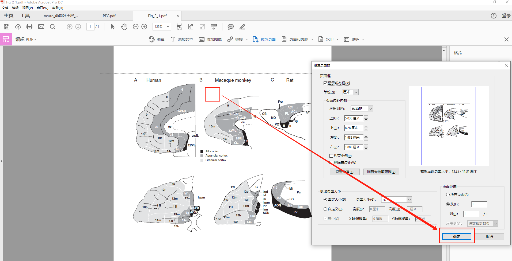
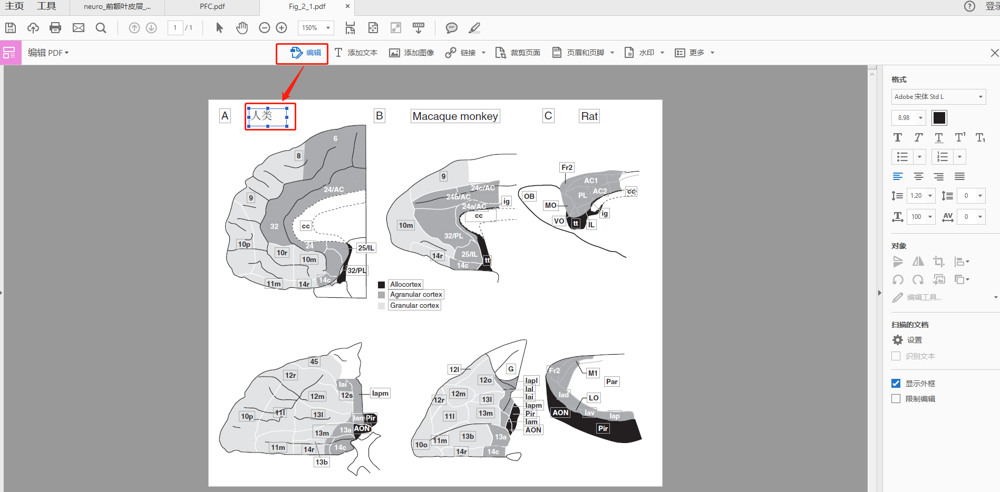

# 翻译文献

### 开发建议

1. 图片统一放进image_pfc文件夹，并按照原文格式命名，如Fig_5_1；
2. 提交代码到开源仓库时创建分支，可按照章节或姓名命名。

### 参考文献
可以在谷歌学术、百度学术等中获得文献条目（bib item），然后把它们添加到`reference.bib`
中。在文中引用的时候，引用它们的键值（bib key）即可。
注意需要在编译的过程中添加`biber`编译，配置如下图所示。

## 持续集成/持续部署
[实现第一个Github Actions](https://docs.github.com/en/actions/quickstart) 。

参考[链接](https://mrturkmen.com/posts/build-release-latex/) ，通过 github actions 生成和处理 latex。

## 图片翻译步骤

1. 组织页面

2. 提取页面

3. 保存图片的PDF页面

4. 编辑PDF页面

5. 删除当前页面和图片无关的内容

6. 选择图片区域

7. 裁剪页面：点击“裁剪页面”，双击空白地方，选中“约束比例”和“删除边距”，然后点“确定”；

8. 编辑并翻译图中文本
